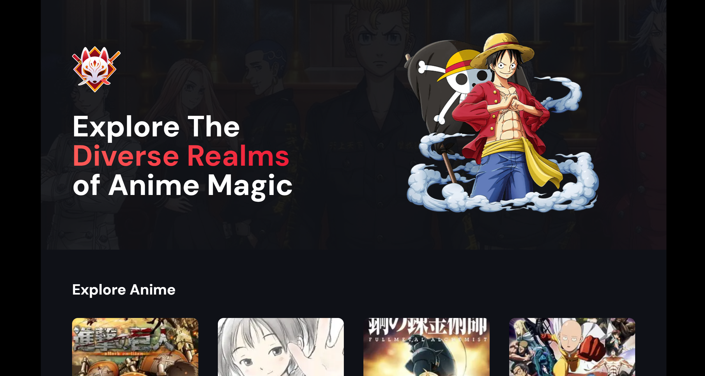

# Anime Vault

[](https://anime-vault-dv192.vercel.app/)

Anime Vault is a modern Next.js 14 server-side application with server actions, infinite scroll, and Framer Motion animations. It displays a dynamic list of anime that are fetched when the user scrolls to the bottom of the page.

## Getting Started

To get a local copy of this project up and running, follow these steps:

### Prerequisites

Make sure you have Node.js installed.

### Installation
Clone the repository and install dependencies.

```bash
git clone https://github.com/DV192/anime-vault.git
cd anime-vault
npm install
```

### Usage
Start the development server.

```bash
npm run dev
```

Visit http://localhost:3000 in your browser.

## Project Inspiration

This project was created by following the tutorial on [JavaScript Mastery YouTube Channel](https://www.youtube.com/@javascriptmastery). Special thanks to the creator for the guidance and inspiration.

## Built With

- [Next.js](https://nextjs.org/)
- HTML, CSS, JavaScript
- React Hooks
- [Framer Motion](https://www.framer.com/motion/)
- [Tailwind CSS](https://tailwindcss.com/)
- TypeScript

## Features
- Modern Next.js 14 server-side application.
- Dynamic fetching of anime list on scroll to the bottom.
- Utilizes server actions for improved server-side rendering.
- Infinite scroll for seamless navigation through the anime list.
- Framer Motion animations to enhance the user interface.
- TypeScript for static typing.

## Deployment

This project is deployed on [Vercel](https://vercel.com/). Visit the live version [here](https://anime-vault-dv192.vercel.app/).
